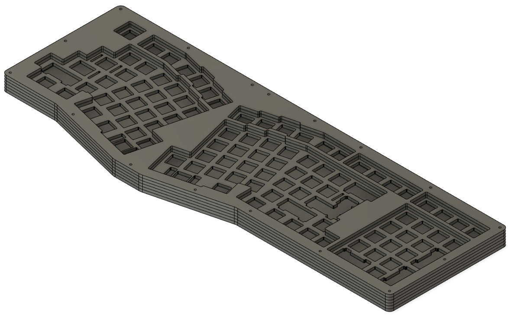
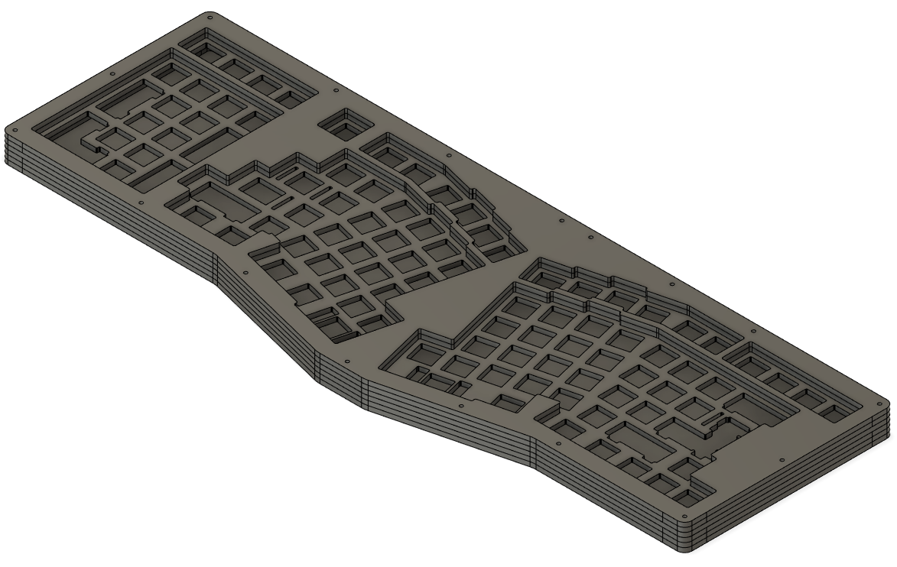

# Jabberwocky Open-Source Stacked Acrylic Case

The Jabberwocky is a full-size columnar-staggered Alice-like split, inspired by the Boardrun Bizarre (designed by shensmobile). It utilizes 2x2.25u Shift keys (like a 660) and moves all of the upper nav cluster keys into the function row (similar to an 1800).

PCBs and DIY kits are available for purchase [here]() and through the [NoPunin10Key discord](https://discord.gg/GVanAmPDCH).

In this repository you'll find files you can use to make your own stacked acrylic case. There are versions for the Dexterous (Right-Handed Numpad) and Sinister (Left-Handed Numpad) variants of the Jabberwocky keyboard.
In total, your case will be composed of **6 layers**.

If you are in the US and do not have access to a laser cutter, I personally recommend [P3DStore](https://p3dstore.com/products/custom-printing-laser-cutting-services) for custom cutting services. You should be able to upload these files and this readme to specify layers and hardware required. You can also source the hardware separately.
P3DStore's in-stock acrylic colors gallery is available to view [here](https://p3dstore.com/pages/in-stock-acrylic-color-options).

## Authors

- Jabberwocky Keyboard designed by [@nopunin10did](https://github.com/nopunin10did)
- Open-source acrylic case design by [@lukeski14](https://github.com/lukeski14)

## License

THE SOFTWARE IS PROVIDED "AS IS", WITHOUT WARRANTY OF ANY KIND, EXPRESS OR IMPLIED, INCLUDING BUT NOT LIMITED TO THE WARRANTIES OF MERCHANTABILITY, FITNESS FOR A PARTICULAR PURPOSE AND NONINFRINGEMENT. IN NO EVENT SHALL THE AUTHORS OR COPYRIGHT HOLDERS BE LIABLE FOR ANY CLAIM, DAMAGES OR OTHER LIABILITY, WHETHER IN AN ACTION OF CONTRACT, TORT OR OTHERWISE, ARISING FROM, OUT OF OR IN CONNECTION WITH THE SOFTWARE OR THE USE OR OTHER DEALINGS IN THE SOFTWARE.

These files are available for non-commercial use only. You explicitly have permission to make objects with these files for yourself, friends, family and coworkers.
## Hardware Required

- 34 × 8mm M2 machine screw
- 17 × 10mm M2 round spacer/standoff

_If you are using a daughterboard, there are mounts on the bottom layer and you will need additional hardware:_

- 4 x M2 machine screw
- 4 x M2 hex nut
## Dexterous (RH) Case

To make a case, you'll need to cut the following layers out of 3mm acrylic or other similar sheet material (wood, etc.)

- 1 x dexterous-top2
- 1 x dexterous-top1
- 1 x dexterous-plate
- 2 x dexterous-mid
- 1 x dexterous-bottom
## Sinister (LH) Case

To make a case, you'll need to cut the following layers out of 3mm acrylic or other similar sheet material (wood, etc.)

- 1 x sinister-top2
- 1 x sinister-top1
- 1 x sinister-plate
- 2 x sinister-mid
- 1 x sinister-bottom
## V1 Jabberwocky PCB

#### IF YOU HAVE A JABBERWOCKY PCB FROM THE ORIGINAL V1 RUN IN 2021:

Use the respective V1 layers in the **/v1_dexerous_pcb_ONLY/** or **/v1_sinister_pcb_ONLY/** subfolders for compatibility (the layouts are slightly different). You do not need the standard (V2) layers.
- 1 x dexterous-plate-v1
- 1 x dexterous-top1-v1
- 1 x dexterous-top2-v1

- 1 x sinister-plate-v1
- 1 x sinister-top1-v1
- 1 x sinister-top2-v1
