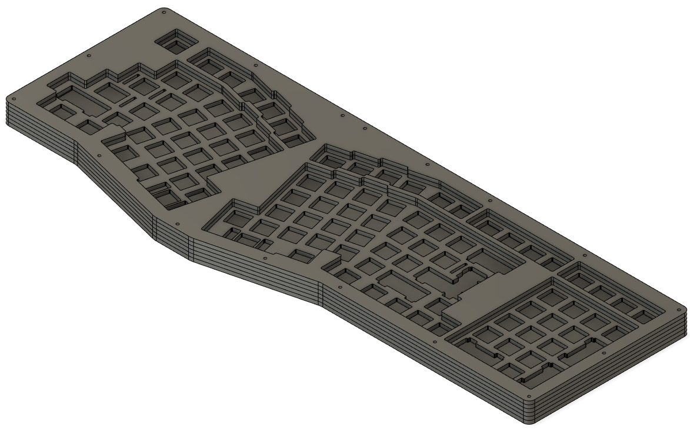

## Hardware Required

- 34 × 8mm M2 machine screw
- 17 × 10mm M2 round spacer/standoff

_If you are using a daughterboard, there are mounts on the bottom layer and you will need additional hardware:_

- 4 x M2 machine screw
- 4 x M2 hex nut
## Dexterous (RH) Case

To make a case, you'll need to cut the following layers out of 3mm acrylic or other similar sheet material (wood, etc.)

- 1 x dexterous-top2
- 1 x dexterous-top1
- 1 x dexterous-plate
- 3 x dexterous-mid
- 1 x dexterous-bottom

## V1 Jabberwocky PCB

#### IF YOU HAVE A JABBERWOCKY PCB FROM THE ORIGINAL V1 RUN IN 2021:

Use the V1 layers in the **/v1_dexerous_pcb_ONLY/** subfolder for compatibility (the layouts are slightly different). You do not need the standard (V2) layers.
- 1 x dexterous-plate-v1
- 1 x dexterous-top1-v1
- 1 x dexterous-top2-v1
